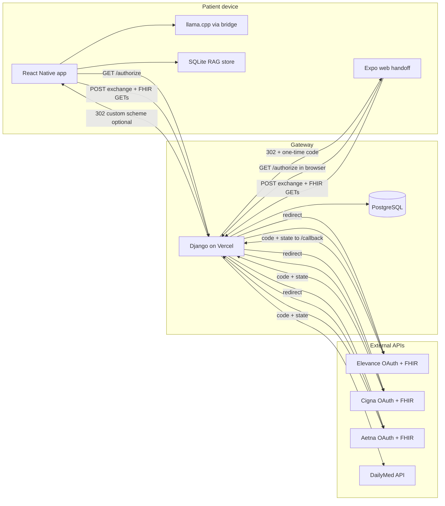

# Medicare Member Retention — Edge-AI POC

This repository is a **proof of concept** for a Medicare member retention tool built around a **zero-trust, on-device** model: clinical reasoning and LLM inference are intended to run **locally** on the patient’s device. The **backend is not a data lake** for PHI—it acts as an **API gateway**, **OAuth broker**, and **HTTP proxy** so the mobile app can reach Elevance FHIR and public drug APIs without embedding secrets in the client where avoidable.

---

## Design goals

| Goal | How it is addressed |
|------|----------------------|
| **Local AI** | React Native app downloads a quantized `.gguf` model and runs inference via **llama.cpp** (through `@react-native-ai/llama`). |
| **No long-lived PHI on the gateway** | Django exchanges OAuth codes and proxies requests; tokens are handed to the app via a **short-lived one-time code**, not pasted into logs by default. |
| **SMART on FHIR + PKCE in serverless** | PKCE `state` + `code_verifier` are stored in **PostgreSQL**, keyed by OAuth `state`—**not cookies**—so flows that bounce through the system browser / Custom Tabs do not break under strict tracking prevention. |
| **Multi-payer gateway** | **`payers.py`** registers **Elevance**, **Cigna**, and **Aetna** (Patient Access); `/authorize/` lists configured payers. OAuth `aud`/scopes and FHIR URL patterns are payer-specific. |
| **Vercel-safe DB usage** | `CONN_MAX_AGE = 0` and a **pooled** `DATABASE_URL` (e.g. PgBouncer / Supabase pooler) to avoid exhausting Postgres connections from ephemeral functions. |
| **CORS** | `django-cors-headers` is configured so **web** testing (Expo web, simulators) does not fail; native apps still send `Authorization` freely. |

---

## Repository layout

```
.
├── api/                          # Vercel serverless entry (WSGI app)
├── gateway/                      # Django app: OAuth session + token exchange models
├── medicare_retention_api/       # Django project (settings, urls, auth_views)
├── mobile/                       # Expo app: Dev Client (llama, RAG) + Expo web static export (handoff UI)
│   └── vercel.json               # Expo *web* project only (npm export → dist); not used by the API project
├── scripts/
│   └── test_fhir_api.py          # Terminal PKCE + FHIR smoke test (Elevance / Cigna / Aetna)
├── manage.py
├── requirements.txt
├── vercel.json                   # Django API: routes + buildCommand (no `builds`; no `functions` for Python path)
└── apiTest.py                    # Legacy one-off script (superseded by scripts/)
```

---

## Architecture (high level)

The system is intentionally split into **two deployable surfaces**: a **Django API** (OAuth broker + FHIR proxies) and an optional **Expo web static bundle** (browser handoff UI). Native **React Native** uses the same API; it can skip the web handoff and consume a custom-scheme deep link.



1. **User starts OAuth** with **`GET /authorize/`** on the **Django host** (HTML picker of configured payers, plus “coming soon” placeholders). Django stores **PKCE** and **`payer_id`** in Postgres (`PkceSession`, keyed by `state`) and redirects to the selected payer’s authorize URL (SMART scopes + PKCE; **`aud`** is the FHIR base for Elevance/Cigna, and a separate **sandbox audience** URL for Aetna—see `payers.py`).
2. The IdP redirects to **`/api/auth/<payer_id>/callback/`** (or legacy **`/callback/`**, which resolves **`payer_id`** from `state` when possible) with **`code` + `state`** (or OAuth **error** query params—Django returns structured JSON instead of a generic `missing_code_or_state`).
3. Django exchanges the Elevance `code` for tokens, encrypts the payload, stores a **short-lived one-time exchange code**, then redirects:
   - **Recommended (desktop + web):** **`APP_HANDOFF_URL_BASE`** — use the **origin only** (e.g. `https://your-expo-web.vercel.app`) so the redirect is **`/?code=...&api_base=...`**. That always loads the static **`index.html`**; a path-only URL like `/handoff` can 404 unless the static host rewrites SPA routes.
   - **Native fallback:** **`APP_DEEPLINK_CALLBACK_BASE`** (e.g. `medicare-retention://oauth/callback?code=...`) if `APP_HANDOFF_URL_BASE` is unset.
4. The **client** (Expo web handoff page or native app) calls **`POST /api/auth/exchange/`** with `{ "code": "<one-time>" }` and receives the token JSON. The handoff page discovers the API via the **`api_base`** query param (or **`EXPO_PUBLIC_API_BASE_URL`**).
5. The client calls **FHIR proxy** on Django with **`Authorization: Bearer <access_token>`** — e.g. **`GET /api/fhir/<payer_id>/Patient/?patient_id=...`** (or legacy Elevance shorthand routes). Django forwards to the payer’s FHIR base (timeouts from `FHIR_HTTP_*` / legacy `ELEVANCE_HTTP_*` env vars).

**Important:** **`/authorize`** and **`/callback`** must hit the **same Django deployment and database** as the PKCE row created for `state`. Mixing local `/authorize` with production `/callback` (or different databases) yields `state_not_found`.

---

## Backend (Django)

### Role

- **OAuth**: SMART Authorization Code + PKCE (**Elevance**, **Cigna**, **Aetna**); callback and token handoff; optional **JWT** `patient` claim decoding when the token response omits top-level `patient`.
- **Proxy**: FHIR compartment reads (Patient, Coverage, Encounter, EOB, MedicationRequest, etc.) and DailyMed `drugnames`.
- **Persistence**: Postgres for PKCE sessions and one-time token exchange records only (not a clinical data warehouse).

### Important endpoints

| Path | Purpose |
|------|---------|
| `GET /` | JSON index of main routes |
| `GET /health/` | Liveness |
| `GET /authorize/` | HTML payer picker → links to `/api/auth/<payer_id>/authorize/` for each configured payer; “coming soon” rows for planned integrations |
| `GET /api/auth/<payer_id>/authorize/` | Start OAuth (`elevance`, `cigna`, `aetna`, …); stores PKCE + `payer_id` in DB |
| `GET /callback/` | Legacy callback; resolves `payer_id` from PKCE `state` when possible, then same logic as payer-specific callback |
| `GET /api/auth/<payer_id>/callback/` | OAuth redirect; token exchange; Cigna uses **`$userinfo`** for `patient_id`; one-time exchange `code` |
| `POST /api/auth/exchange/` | Body: `{"code":"<one-time>"}` → token JSON + `payer_id` + `patient_id` |
| `GET /api/fhir/<payer_id>/<resource_type>/?patient_id=...` | Generic FHIR proxy: `Patient`, `Coverage`, `Encounter`, `ExplanationOfBenefit` / `eob`, `MedicationRequest`, `MedicationStatement`, `MedicationDispense`, `Claim`, `ClaimResponse` (aliases: `rx`, `med`, …) |
| `GET /api/fhir/patient/` … | **Elevance shorthand** (same as `/api/fhir/elevance/...`) |
| `GET /api/drugs/?name=...` | Proxied DailyMed drug name search (POC) |
| `GET /api/debug/oauth/?payer=...` | If **`OAUTH_DEBUG=1`**: redirect URI, client id, **oauth audience** (Aetna), etc. |

### Multi-payer FHIR proxy behavior (`auth_views.py` + `payers.py`)

- **`PayerConfig`** (in **`medicare_retention_api/payers.py`**) drives OAuth URLs, **`aud`** (Aetna uses a sandbox audience **different** from the FHIR API base), scopes, **`patient_lookup_mode`** (`path` vs `Patient?_id=`), and **`fhir_unsupported_resources`** (types that return an **empty search `Bundle`** with **200** instead of calling the payer—avoids 400/404 noise in the handoff UI).
- **Patient bundle unwrap**: Cigna (and similar) may return a **search `Bundle`** for `Patient?_id=...`. The proxy returns a **single `Patient`**, preferring **`id`** prefixed with **`gov-`** when multiple entries exist (downstream compartment reads align with that id where applicable).
- **Cigna — full proxy** (default in code, **`CIGNA_LEGACY_FHIR_PROXY=0`**): optional **`&_count=`**, follows **`Bundle.link`** **`next`** (same env knobs as other payers), **dual-patient merge** for **ExplanationOfBenefit** and **MedicationRequest** when the client passes **`merge_patient_id`** (handoff app sends it when **`Patient.id`** ≠ token `patient` id, e.g. **`A000…`** vs **`gov-*`**). Set **`CIGNA_LEGACY_FHIR_PROXY=1`** to revert to a single GET per resource with **no** merge/pagination.
- **Cigna — legacy proxy** (**`CIGNA_LEGACY_FHIR_PROXY=1`**): one GET per resource, **no** `&_count=`, **no** `next` merge, **no** dual-patient merge. Types in **`_CIGNA_FHIR_UNSUPPORTED`** return an **empty `Bundle`** without calling Cigna.
- **Cigna — mobile handoff**: compartment queries use the **token / userinfo `patient` id**; when the returned **`Patient.id`** differs, **`merge_patient_id`** is appended. The API also **follows `Patient` search Bundle `next` links** (when **`CIGNA_PATIENT_BUNDLE_PAGINATION=1`**) and, for **EOB** / **MedicationRequest**, **auto-merges** every linked **`Patient.id`** found there (**`CIGNA_AUTO_MERGE_PATIENT_IDS=1`**) so **pharmacy** CARIN-BB EOBs tied to **`gov-*`** are not dropped when **`esi-*`** appears on the first page.
- **Elevance / Aetna**: optional **`FHIR_DEFAULT_SEARCH_COUNT`** (`&_count=`); **`FHIR_PROXY_FOLLOW_BUNDLE_NEXT`** (default **`1`**) and **`FHIR_PROXY_MAX_PAGES`** merge paged **`Bundle`** responses. Set **`FHIR_PROXY_FOLLOW_BUNDLE_NEXT=0`** for first-page-only.
- **Aetna authorize URL**: built with **`build_oauth_authorize_query_string`** so **`scope`** keeps a **literal `*`** in `patient/*.read` (some IdP UIs mishandle `%2A`). Optional **`AETNA_APP_NAME`** → `appname` query param. **Claim / ClaimResponse** (and **MedicationStatement**) are treated as unsupported for Aetna where the API returns **404** / not-implemented.
- **OperationOutcome handling**: for some payers, specific **`not-supported`** outcomes are mapped to an empty **`Bundle`**; the match is **narrow** (e.g. wording like “resource not available”) so real errors are not swallowed.

### Environment variables

**Elevance / SMART**

- `ELEVANCE_CLIENT_ID`, `ELEVANCE_CLIENT_SECRET` (optional for public PKCE-only clients)
- `ELEVANCE_REDIRECT_URI` — must match the redirect URI registered with Elevance (e.g. **`https://<your-host>/callback/`** legacy, or **`https://<your-host>/api/auth/elevance/callback/`**)
- `ELEVANCE_AUTH_URL`, `ELEVANCE_TOKEN_URL`, `ELEVANCE_FHIR_BASE_URL`
- `ELEVANCE_SCOPE` (optional; default includes `launch/patient patient/*.read openid fhirUser`)

**Cigna / SMART (public PKCE)**

- **Required:** `CIGNA_CLIENT_ID`, `CIGNA_REDIRECT_URI` (must match the Cigna developer portal; e.g. `https://<your-host>/api/auth/cigna/callback/`)
- **Optional:** `CIGNA_CLIENT_SECRET` — omit when Cigna did not issue a secret (public client + PKCE)
- **Optional URL overrides** (sandbox defaults are built into `payers.py` from [Cigna Patient Access sandbox](https://developer.cigna.com/docs/service-apis/patient-access/sandbox)): `CIGNA_AUTH_URL`, `CIGNA_TOKEN_URL`, `CIGNA_FHIR_BASE_URL`, `CIGNA_USERINFO_URL`
- `CIGNA_SCOPE` (optional)
- **`CIGNA_LEGACY_FHIR_PROXY`** — default **`0`**: full Cigna FHIR path (pagination, optional **`merge_patient_id`** merge for EOB/MedRequest). Set **`1`** for legacy single-GET behavior without merge/pagination.

**Aetna Patient Access (sandbox defaults in `payers.py`; confidential client + PKCE)**

- **Required:** `AETNA_CLIENT_ID`, `AETNA_CLIENT_SECRET`, `AETNA_REDIRECT_URI` (e.g. `https://<host>/api/auth/aetna/callback/`)
- **Optional:** `AETNA_AUTH_URL`, `AETNA_TOKEN_URL`, `AETNA_FHIR_BASE_URL`, `AETNA_SCOPE`
- **`AETNA_AUD`** — OAuth token **`aud`**; defaults to the sandbox audience URL in code (separate from the FHIR API base)
- **`AETNA_APP_NAME`** — if the Aetna login page shows **`null`**, set this to the **App Name** from the developer portal (sent as **`appname`** on authorize)
- **`AETNA_USERINFO_URL`** — if Aetna documents a userinfo endpoint and the token response lacks `patient`, set when needed

**App handoff**

- `APP_HANDOFF_URL_BASE` — **recommended** Expo web **origin** only, e.g. `https://your-expo-web-host.vercel.app` (backend appends `?code=...&api_base=...`; avoid `/handoff` unless your static host rewrites that path to `index.html`)
- `APP_DEEPLINK_CALLBACK_BASE` — native fallback, e.g. `medicare-retention://oauth/callback` (custom scheme; desktop browsers cannot open this). Used only if `APP_HANDOFF_URL_BASE` is unset.
- `PUBLIC_API_BASE_URL` (optional) — explicit API host used when generating handoff redirect `api_base=...` query param for the web handoff page

**Token encryption at rest (exchange table)**

- `TOKEN_ENCRYPTION_KEY` — Fernet key, e.g.  
  `python -c "from cryptography.fernet import Fernet; print(Fernet.generate_key().decode())"`

**Database**

- `DATABASE_URL` — use a **pooler** connection string in production (Supabase pooler, PgBouncer, etc.)
- `DB_SSL_REQUIRE` — default `1` when using `DATABASE_URL`

**Django**

- `DJANGO_SECRET_KEY`, `DJANGO_DEBUG`, `DJANGO_ALLOWED_HOSTS`, `DJANGO_TIME_ZONE`

**CORS**

- `CORS_ALLOW_ALL_ORIGINS` — default `1` for POC; set `0` and `CORS_ALLOWED_ORIGINS` for production

**FHIR proxy HTTP timeouts**

- `FHIR_HTTP_CONNECT_TIMEOUT_S`, `FHIR_HTTP_READ_TIMEOUT_S` — override defaults (**20** / **90** s); legacy aliases `ELEVANCE_HTTP_*` still work

**FHIR proxy pagination / page size** (Elevance, Aetna, and Cigna unless **`CIGNA_LEGACY_FHIR_PROXY=1`**)

- `FHIR_DEFAULT_SEARCH_COUNT` — optional; appended as **`&_count=`** on compartment searches when set
- `FHIR_PROXY_FOLLOW_BUNDLE_NEXT` — default **`1`**; set **`0`** to disable following **`Bundle.link`** **`next`**
- `FHIR_PROXY_MAX_PAGES` — max pages to fetch when following **`next`** (default **50**, including the first response)

**Debug (temporary)**

- `OAUTH_DEBUG` — set to **`1`** only while troubleshooting; enables **`GET /api/debug/oauth/?payer=elevance`** (or `cigna`, `aetna`). Remove or set **`0`** afterward.

### Local development

```powershell
cd "c:\Users\brtom\Documents\Medicare Retention"
python -m venv .venv
.\.venv\Scripts\Activate.ps1
pip install -r requirements.txt
```

**`.env`:** With `python-dotenv` installed, both Django and `scripts/test_fhir_api.py` load a `.env` file from the **project root** (same folder as `manage.py`). Variable names must match the documented `ELEVANCE_*` / `CIGNA_*` / `AETNA_*` / `DJANGO_*` keys—creating `.env` alone does nothing until you run `pip install -r requirements.txt` (or `pip install python-dotenv`).

**Postgres on localhost:** If `.env` sets `DATABASE_URL` to Postgres (e.g. for Vercel) but **no Postgres is running on your PC**, `runserver` will fail with *connection refused* on port 5432. For local API work, either:

- Set **`DJANGO_USE_SQLITE=1`** in `.env` (uses `db.sqlite3` in the project folder and ignores `DATABASE_URL` for Django), **or**
- Remove / comment out `DATABASE_URL` locally so Django falls back to SQLite, **or**
- Install and start PostgreSQL locally to match `DATABASE_URL`.

Set env vars (at minimum for OAuth views: Elevance vars + `TOKEN_ENCRYPTION_KEY`; for DB: use `DJANGO_USE_SQLITE=1` locally or a reachable `DATABASE_URL`).

```powershell
python manage.py migrate
python manage.py runserver
```

Open `http://127.0.0.1:8000/` — you should see JSON describing the API. A 404 on `/` before the root route was added meant no route existed; the project now serves **`GET /`** as a small JSON index.

**Phone or another PC on the same LAN:** `runserver` only binds to localhost by default, so **`http://192.168.x.x:8000` will not work** from other devices until you run:

`python manage.py runserver 0.0.0.0:8000`

Allow **Python** through Windows Firewall if prompted. (This is separate from **Expo/Metro on port 8081** — see [mobile/README.md](mobile/README.md).)

### Vercel (Django API project)

- Repo **root** `vercel.json` uses **`routes`** to `api/index.py`, plus **`buildCommand`: `python vercel_build.py`**. **No legacy `builds`** (it skips `buildCommand`). **No `vercel.json` `functions` block for `api/index.py`** — Vercel matches that pattern only for Node handlers; Python is auto-discovered and a `functions` entry breaks the build.
- **Deploy checklist:** see **[DEPLOY_VERCEL.md](DEPLOY_VERCEL.md)** — env vars, Postgres + `migrate` on build, Elevance redirect URI, and troubleshooting.
- **Template:** [`.env.example`](.env.example) lists variable names (no secrets).
- Keep handlers **fast**: outbound HTTP uses short timeouts; no long-running tasks.

---

## Expo web static app (“frontend project”) and how it connects to the backend

The **browser handoff** experience is a **separate static site** produced by **`npx expo export -p web`** from **`mobile/`**. It is **not** the Django server: Django only returns JSON APIs, not the React bundle.

### Why two Vercel projects?

| Project | Root in repo | Config file | Build | Output |
|--------|----------------|------------|-------|--------|
| **API (Django)** | Repository root (default) | Root `vercel.json` — **`routes`** + `vercel_build.py` (no `builds` / no Python `functions` pattern) | `pip` + `vercel_build.py` (collectstatic + migrate) | Serverless Python |
| **Expo web (handoff UI)** | **`mobile`** | **`mobile/vercel.json`** — **no** `builds` | `npm install` + `npx expo export -p web` | Static **`dist/`** |

Create **two** Vercel projects linked to the **same GitHub repo**: one for the API (root), one for Expo web (**Root Directory = `mobile`**). The Expo project must **not** use the root `vercel.json`; Vercel resolves config from the **root directory** you set.

### Repository `.vercelignore` (important)

The repo root **`.vercelignore`** must **not** ignore the entire **`mobile/`** tree. A line like `mobile` was used originally to shrink API uploads; that **removes** `mobile/package.json` from the upload and breaks **`npm install`** when Root Directory is `mobile`. Ignore only heavy paths (e.g. `mobile/node_modules`, `mobile/android`, `mobile/ios`) instead.

### How the handoff page talks to the API

1. After OAuth, Django redirects the browser to  
   **`https://<expo-web-host>/?code=<one-time-exchange-code>&api_base=https%3A%2F%2F<api-host>`**  
   (optional **`PUBLIC_API_BASE_URL`** on the API can force `api_base` if you need a canonical API URL).

2. The **Expo web** bundle loads from **`/`** (always **`index.html`**). The handoff screen reads **`code`** and **`api_base`** from the query string.

3. The browser sends **`POST https://<api-host>/api/auth/exchange/`** with the one-time `code` (CORS allows this for POC; lock down **`CORS_ALLOWED_ORIGINS`** in production).

4. With the returned **`access_token`**, the handoff UI calls **`GET`** on the FHIR proxy on the **same API host** — e.g. **`/api/fhir/<payer_id>/Patient/?patient_id=...`** (Elevance shorthand **`/api/fhir/patient/`** still works) — with **`Authorization: Bearer ...`**. The mobile handoff uses the returned **`payer_id`** and, for Cigna, the token **`patient`** id for compartment reads.

5. **`EXPO_PUBLIC_API_BASE_URL`** (optional) can override the API base for local web dev; production usually relies on **`api_base`** from the redirect.

See **[mobile/README.md](mobile/README.md)** for Vercel dashboard pitfalls (Python build logs on the Expo project = wrong root or root `builds` winning), `.vercelignore`, and local web testing URLs.

---

## Phase 1: Terminal PKCE test

`scripts/test_fhir_api.py` mirrors the same OAuth parameters as the Django app (scopes, `aud`, PKCE S256, Aetna authorize query encoding) but runs entirely in the terminal for integration testing. Use **`--payer 1`** / **`elevance`**, **`--payer 2`** / **`cigna`**, **`--payer 3`** / **`aetna`**, or omit **`--payer`** for an interactive prompt.

```powershell
# Elevance example (set the matching *_REDIRECT_URI and client vars per payer)
$env:ELEVANCE_CLIENT_ID="..."
$env:ELEVANCE_CLIENT_SECRET="..."
$env:ELEVANCE_REDIRECT_URI="https://your-registered-callback"
python .\scripts\test_fhir_api.py --payer 1

# Cigna: CIGNA_CLIENT_ID, CIGNA_REDIRECT_URI
# Aetna: AETNA_CLIENT_ID, AETNA_CLIENT_SECRET, AETNA_REDIRECT_URI
```

See `scripts/README.md` for a shorter quick start.

---

## Mobile app (`mobile/`)

See **[mobile/README.md](mobile/README.md)** for dependency hygiene (avoid `npm audit fix --force`, use `npx expo install`), OAuth handoff, and **Expo web on Vercel** troubleshooting.

- **Expo + Dev Client** so native modules (llama, SQLite) are usable on **iOS/Android**.
- **Expo web** (`npx expo start --web` / `npx expo export -p web`): same React Native code targets a **static** bundle for the **sign-in handoff** page (patient summary, coverage, encounters, EOB / pharmacy-oriented summaries, medication requests where returned) after redirect from Django; payer-specific FHIR behavior is handled by the API (**`HandoffScreen`** uses token **`patient`** for Cigna compartment calls). **Technical details** (tokens, raw FHIR JSON) are behind a toggle.
- **`ModelManager`**: downloads `.gguf` from an HTTPS URL into app document storage with progress.
- **`LlamaService`**: loads the model via `@react-native-ai/llama` (`languageModel` + `textEmbeddingModel`), exposes completion and embedding helpers used by the RAG scaffold.
- **`LocalVectorStore`**: SQLite persistence for chunk text + embedding vectors; similarity search is implemented in-process in the POC (ready to swap for **sqlite-vss** when the native extension is available in your build).
- **`process_medical_data`**: chunks FHIR-shaped JSON, calls **llama embeddings** (not random hashes), and stores rows for later retrieval.

Install and run (from `mobile/`):

```powershell
cd mobile
npm install
npx expo prebuild   # if you use custom native modules / dev client builds
npx expo start
```

Exact native build steps depend on your machine (Xcode / Android Studio); Dev Client is required for full llama + SQLite extension workflows.

---

## Security notes (POC)

- Treat **`ELEVANCE_CLIENT_SECRET`**, **`AETNA_CLIENT_SECRET`**, **`CIGNA_CLIENT_SECRET`** (if used), and **`TOKEN_ENCRYPTION_KEY`** as secrets; never commit them.
- The one-time exchange code is **single-use** and short-lived; still protect your API host with HTTPS and rate limits in production.
- FHIR access tokens are **highly sensitive**; store them only in platform secure storage on device. The **web handoff** page intentionally shows **masked** tokens and **summaries**; raw JSON is hidden behind a **technical details** toggle—do not treat the handoff URL as a long-term PHI surface in production without hardening.

---

## Related files

- OAuth + FHIR proxies: `medicare_retention_api/auth_views.py`, `medicare_retention_api/payers.py`
- URL routing: `medicare_retention_api/urls.py`
- Models: `gateway/models.py`
- Settings (Postgres, CORS, `CONN_MAX_AGE`): `medicare_retention_api/settings.py`
- Handoff UI + FHIR display helpers: `mobile/src/screens/HandoffScreen.tsx`, `mobile/src/utils/fhirDisplay.ts`
- Expo web Vercel config: `mobile/vercel.json`
